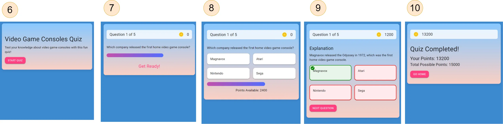

## Quiz App using AWS Amplify Gen2

This repository is the code for a tutorial on how to build an app that uses AI to auto generate quizzes. The tutorial shows how to build the app using AWS Amplify Gen2 and React.

## App Overview

This template equips you with a foundational React application integrated with AWS Amplify, streamlined for scalability and performance. It is ideal for developers looking to jumpstart their project with pre-configured AWS services like Cognito, AppSync, and DynamoDB.

### Creating and Managing Quizzes

1. The user can create a quiz, and see all the quizzes they have created. A page shows a list of quizzes they have created and a “create quiz” button. When they click on the “create quiz” button, they will be brought to a form.
2. The can enter the description of the quiz, the number of questions of the quiz, and can attach additional knowledge to be used to make the quiz questions.
3. When attaching a knowledge file, the user can either upload a new file, or select from already uploaded files.
4. The quiz will be auto-generated using AI. After the quiz has been generated, the user sees the result and can edit any of the quiz properties. The user can save their changes.
5. On the list of quizzes page, the user can click on the context menu of a quiz, and can delete, edit, duplicate and run a quiz.

### Taking a Quiz

6. When taking a quiz, the user sees an introductory screen that describes what the quiz is about, with a button to start the quiz.
7. Once the quiz starts, the user sees a question preview for 5 seconds.
8. The user sees the answer choices. They will have 20 seconds to select their answer. There is be a count-down progress bar, displaying how much time is remaining. There is a display showing how many points the user gets if they answer the question. Every 5 seconds, the amount of points available decreases.
9. Once the user selects an answer, the app displays which answer was correct and which were incorrect, as well as an explanation. There is a button to move on to the next question.
10. Once all the questions have been answered, the user is shown how many points they have earned, and how many were possible.

### Data Model

## Features

- **Authentication**: Amazon Cognito for secure user authentication.
- **API**: Ready-to-use GraphQL endpoint with AWS AppSync.
- **Database**: Real-time database powered by Amazon DynamoDB.
- **Object Storage**: AWS S3 for high-performance object stroage.
- **Lambda**: Custom lambda function for calling an external LLM.

## Deploying to AWS

For detailed instructions on deploying your application, refer to the [deployment section](https://docs.amplify.aws/react/start/quickstart/#deploy-a-fullstack-app-to-aws) of our documentation.

## Security

See [CONTRIBUTING](CONTRIBUTING.md#security-issue-notifications) for more information.

## License

This library is licensed under the MIT-0 License. See the LICENSE file.
